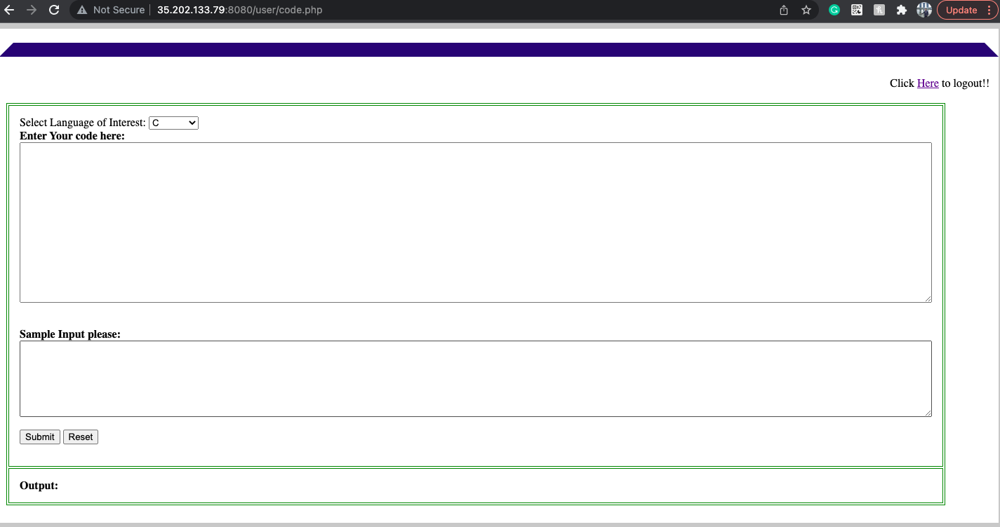
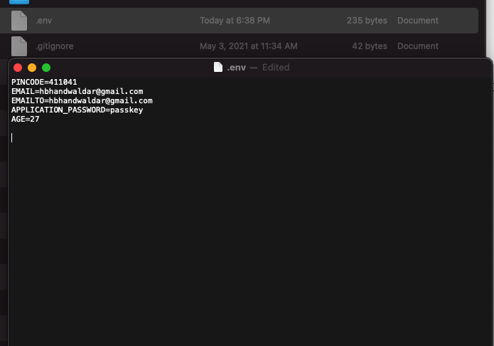
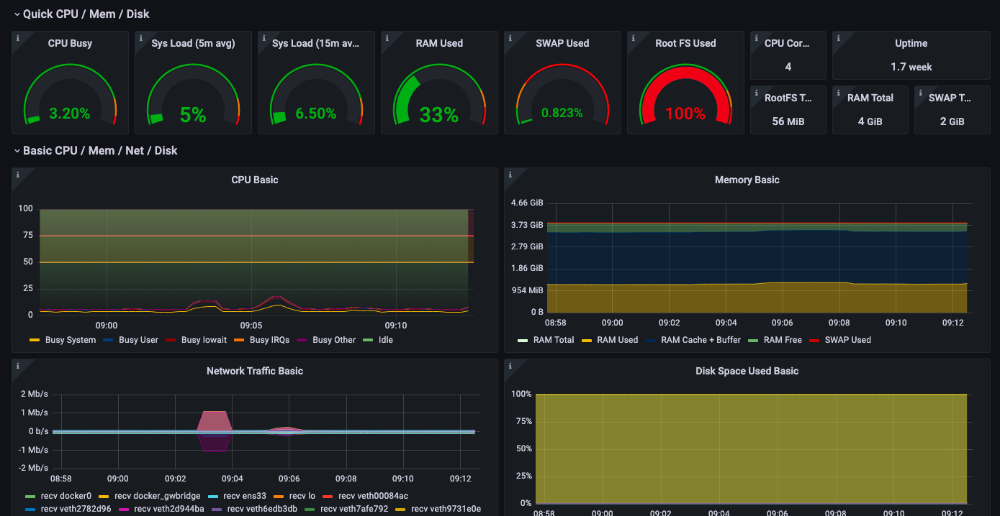

<!-- Main -->

<!-- Two -->
<section id="two" class="spotlights">
	<section>
		
		

			

				<header class="major">
					<h3>PI-Cloud: Smart Personalized Cloud for Corporates and Educational Institutes.</h3>
				</header>
				
Online compiler deployed on a low-cost server using Raspberry Pi 3b+. Designed a lightweight framework that can handle multiple user requests using PHP and JQuery. Secure login for authorized users by SQL MD5 password hashing. Developed for schools and institutes for basic usage of computer programming.

				
Login and password for demo - user

				<ul class="actions">
					<li><a href="https://picloud.ngrok.io/" class="button">DEMO</a></li>
					<li><a href="https://github.com/hb0313/Pi-Cloud" class="button">CODE</a></li>
				</ul>
			

		

	</section>
	<section>
		
		

			

				<header class="major">
					<h3>Vaccine Notifier</h3>
				</header>
				
VaccineNotifier checks the Cowin portal periodically to find vaccination slots available in your pin code and for your age. If found, it will send you emails every minute until the slots are available.

				<ul class="actions">
					<li><a href="https://csecodeblock.blogspot.com/p/vaccine-notifier.html" class="button">CODE</a></li>
				</ul>
			

		

	</section>
	<section>
		
		

			

				<header class="major">
					<h3>Infra Monitoring</h3>
				</header>
				
Infra monitoring using Docker, InfluxDB, Flux, telegraf, and Grafana. Deployed on Google Cloud to maintain the availability of the dashboard. Usable to monitor the on-prem infrastructure like Dataware house, server machine, miners, etc. Multiple system support on a single dashboard, time serial database, and telegraf scrapper.

				<ul class="actions">
					<li><a href="#" class="button">CODE</a></li>
				</ul>
		

	</section>

